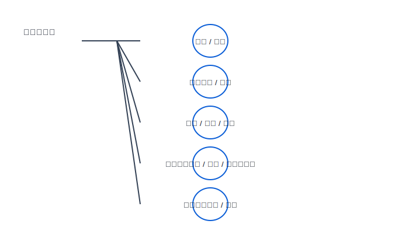
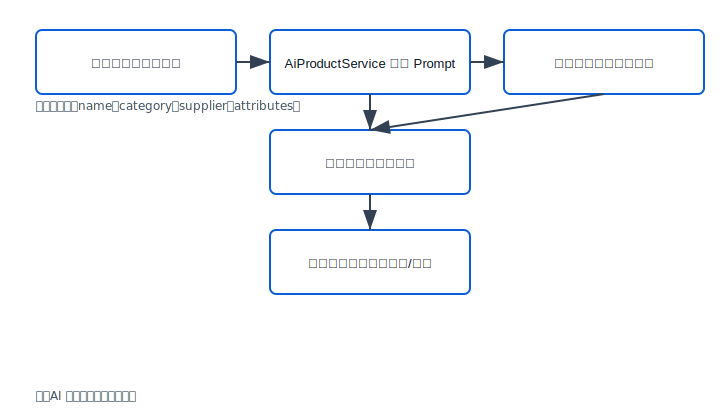
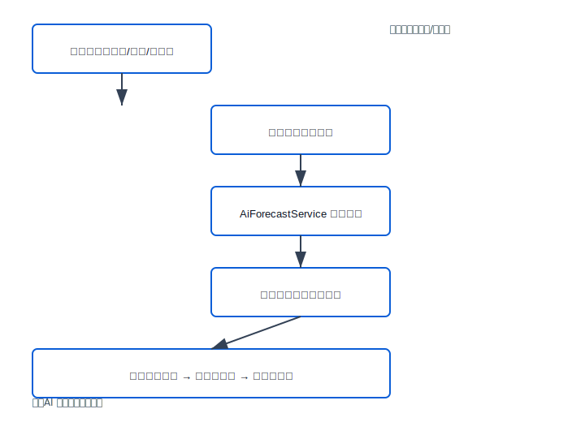

# SwiftStock AI 电商仓储管理系统设计与实现

## 1 前言

### 1.1 选题背景
近年来，随着电子商务的迅猛发展，我国网络零售额持续高速增长。电商业务的爆发式增长带动了仓储物流需求的急剧上升，仓库端呈现出“多品类、小批量、高频出入库”的新特征。传统依赖人工台账或Excel表格的管理方式，在库存准确性、作业效率、信息透明度和异常追溯等方面暴露出明显短板，容易导致库存积压、缺货断销或订单履约延误等问题。

现有研究表明，引入信息化仓储管理系统（WMS）能够显著提升仓库作业的实时性和准确性［1,9,13］。王玉魁等基于Spring Boot与Vue设计的仓储管理系统验证了Web技术在库存控制与报表统计中的应用价值［1］；李伟［9］和Yi等［13］从业务流程视角给出了入库、出库、盘点等模块的可复用设计思路；魏巧巧以京东物流WMS为例，分析了大数据技术在库存优化与作业调度中的作用［3］。这些实践表明，信息化系统已成为现代仓储管理的必要手段。
与此同时，人工智能技术的快速发展为传统管理类系统提供了新的提升路径。Spring AI框架的出现，使Java生态能够便捷集成大语言模型，实现自然语言处理与智能决策辅助［12］。在仓库管理领域，AI可用于商品详情自动生成与补货需求预测，从而降低人工操作强度并提升决策效率。

基于上述行业背景与技术趋势，本课题以中小型电商仓库为应用场景，设计并实现SwiftStock AI电商仓库管理系统。系统基于Spring Boot + Vue 3前后端分离的设计，重点实现商品管理、订单处理、库存控制、供应商与供货记录维护、数据统计等核心功能，并创新性地引入人工智能辅助模块，支持AI智能生成商品描述与AI智能补货推荐，为仓库管理者提供从基础作业到智能决策的全链路支持。


### 1.2 选题意义
本课题的意义可以从“业务应用价值”和“工程实践价值”两个层面展开。

业务应用价值：已有研究表明，引入基于 Spring Boot + Vue 的仓储管理系统，可以在库存准确性、作业效率和信息透明度方面有效提升仓库管理水平［1,3,9,13,14］。但在中小型电商仓库场景中，通用 WMS 方案往往功能过于庞杂、部署成本较高，难以快速落地。SwiftStock AI系统通过统一的商品-订单-库存数据模型、可视化仪表盘以及AI智能辅助功能，能够有效解决库存不透明、补货决策滞后、商品上架文案耗时等问题。AI智能生成商品描述可大幅缩短新品上架时间；AI智能补货推荐基于历史销售与当前库存动态预测需求并给出自然语言建议，帮助管理者避免缺货或积压风险，提升库存周转率与运营效率，降低仓储信息化系统的门槛，帮助仓库从“经验驱动”逐步过渡到“数据驱动”。

工程实践价值：近年来许多系统建设案例都采用 Spring Boot + Vue + MyBatis 的技术组合［1,2,4,5,7,10,11,12,15］，以及 RESTful API 的前后端分离开发模式［6,8］。在本课题中，引入同样的技术栈，可以完整经历需求分析、体系结构设计、数据库建模、接口设计、前后端协作开发、系统测试等工程实践环节，此外还通过Spring AI框架[12]集成DeepSeek大语言模型，探索了传统管理类系统与人工智能技术的融合路径，为后续开发更复杂的智能应用积累经验。
围绕以上两方面，本系统拟重点解决以下实际问题：

**业务层面问题：**
1.库存盘点与记录：传统人工记录入库出库操作容易出错，缺乏实时库存追踪，导致库存数据不准确。系统通过自动化的库存流水记录与批量操作功能，实现库存变动的实时追踪与准确记录。

2.补货决策：管理者依赖经验判断补货时机与数量，容易造成缺货或库存
积压。系统通过历史订单数据分析与AI智能补货推荐，提供基于销售趋势的补货建议，帮助优化库存周转。
3.商品信息管理：新商品上架需要手动录入详细信息，耗时且容易遗漏。系统通过AI智能生成商品描述功能，基于商品名称、分类与供应商信息自动生成商品文案，提高上架效率。

4.库存预警机制：无法及时发现低库存或缺货风险。系统通过库存阈值设置，实时监控库存状态。

5.数据统计分析：缺乏统一的可视化看板，难以快速获取库存概况、销量趋势等关键指标。系统通过仪表盘与报表功能，提供商品数量、补货推荐、库存预警、销售趋势、商品分布、最近订单、库存状态分布与分类库存统计等多维度数据展示。


**技术层面问题：**
1.系统安全性：缺乏有效的用户认证与权限控制机制。系统通过JWT令牌认证与单管理员权限模型，确保系统访问的安全性。

2.数据一致性：并发操作可能导致库存数据错乱。系统通过事务管理保证订单创建与库存扣减的数据一致性。

3.接口设计：前后端数据传输缺乏统一标准。系统采用RESTful API设计与统一响应格式，实现前后端高效协作。

4.数据库访问效率：直接SQL操作效率低下且易出错。系统通过MyBatis框架实现ORM映射与动态SQL，提高数据访问效率与安全性。


### 1.3 国内外研究现状
综观国内外研究与实践，围绕仓储管理系统的工作主要可以分为三个维度：仓储业务与 WMS 模型研究、Web 应用框架与前后端分离技术研究以及二者的交叉应用研究。

1）仓储业务与 WMS 模型研究  
国内外针对仓储管理信息系统的研究较为丰富。李伟［9］、Yi［13］等从仓库业务流程视角出发，系统性地给出了入库、出库、报表等模块的功能划分和数据流转关系，为本课题中仓储业务功能的设计提供了直接参考。魏巧巧［3］以京东物流 WMS 系统为例，从大数据与智慧仓储角度分析了库存优化、路径规划与作业调度策略，说明在大型仓储企业中，WMS 不仅承担基础作业管理，还需要为运营决策提供数据支撑。Shree 等［14］则从可持续农业仓储出发，对仓储管理系统在供应链中的角色与需求进行了梳理，进一步印证了构建高效、可扩展 WMS 的重要性。

2）Web 应用框架与前后端分离技术研究  
在技术实现层面，大量文献聚焦于 Spring/Spring Boot、MyBatis、Vue 等框架的工程化应用。李兴华等［7］、汤智宏［10］和欧阳宏基等［4］分别从 SSM 和 MyBatis 的角度，研究了数据持久层设计、事务控制与性能优化问题，为本系统在持久化层的设计提供了方法论支持。曲锦旭［8］与孙业超［6］则分别从前后端分离模式和 RESTful API 接口测试出发，讨论了接口规范、接口测试策略以及接口质量对系统可维护性的影响。王培培［2］、崔靖茹等［5］以及汤智宏［10］通过网上商城、OJ 系统等案例展示了 Spring Boot 在 Web 应用中的实践路径；王玉魁等［1］、崔靖茹等［5］、孙业超［6］、曲锦旭［8］、汤智宏［10］和Ning Y［15］则表明，Spring Boot + Vue 的组合已经成为当前企业级信息系统（如仓储管理、高校项目管理、线上书店等）中广泛采用的技术栈。

3）技术与业务的交叉应用研究  
在交叉研究方面，基于 Spring Boot + Vue 的仓储管理系统设计与实现已经有较为具体的工程案例［1,9,13］，这些工作通常围绕商品、订单、库存三大基础对象展开，强调系统在库存准确性、作业效率和信息可视化方面的改进。高校信息化项目管理系统［5］、线上书店［10］以及个人健康信息服务平台［15］等研究，则从不同业务场景验证了前后端分离架构、RESTful API 设计以及前端组件化开发在提高系统可扩展性、可维护性方面的优势。与此同时，基于 MySQL 的数据录入与存储优化研究［12］也为本课题中数据库设计与索引优化提供了参考。

综上，现有研究在业务模型与技术框架方面积累丰富，但针对中小电商仓库的轻量级系统以及人工智能辅助功能的研究相对不足。本课题在继承成熟技术路线的基础上，创新性地集成大语言模型，实现AI智能生成商品描述与补货推荐，具有一定的理论意义和实践价值。


## 2 系统需求分析

### 2.1 问题描述
本系统面向中小型电商仓库的典型管理场景。随着电商订单量的快速增长，仓库端面临商品种类繁多、库存变动频繁、订单履约时效要求高等挑战。传统依赖人工台账或Excel的管理方式，容易导致库存数据不准确、补货决策滞后、商品上架文案耗时以及订单状态追踪困难等问题，进而引发缺货断销、库存积压或履约延误等业务风险。

现有信息化系统虽能解决部分问题，但往往存在商品详情维护效率低、补货依赖人工经验、预警机制被动等不足。本系统SwiftStock AI以“商品—订单—库存”为核心对象，聚焦仓库作业管理与运营分析，旨在通过数字化手段提升库存准确性与作业效率，并创新性地引入人工智能辅助功能，实现商品描述智能生成与补货需求智能预测，从而为仓库管理者提供从基础操作到智能决策的全链路支持。

系统边界定义为仓库内部管理中台，不涉及电商前台（用户浏览、下单、支付）与外部物流对接，而是以“订单录入/管理”的方式模拟电商订单进入仓库后的履约过程


### 2.2 系统业务描述
系统旨在解决的业务问题与实现目标：
- 问题：提高预测精度、减少缺货/滞销、提高补货决策透明度、提升日常仓储运营效率。
- 目标：构建一套集成 AI 预测、补货建议与可审计运行链路的仓储管理系统；提供面向运营的可视化看板。

核心功能概述：
- 用户认证（登录）。
- 商品管理（创建、分类、价格、库存阈值设置）。
- 库存管理（入库/出库/库存记录/批量操作）。
- 订单管理（创建、查询、状态流转、取消、库存扣减）。
- 供应商与供货记录管理（供应商维护、供货记录维护）。
- 库存预警与报表（看板、销售趋势、低库存/缺货统计）。
- AI 模块：补货建议生成、商品详情文案生成。
  
主要用户群体：
- 系统管理员（Admin）：本系统为单管理员系统，系统管理员承担所有功能：商品与供应商维护、库存入库/出库与调整、生成与审核补货建议、采购单创建与查看预测报表等。


业务流程图（图 2-1）


（图示为系统核心业务流程示意，展示仓库内部管理中台的核心业务流程：从管理员登录、商品建档、订单管理、库存操作，到AI补货建议生成、采购管理、供货对账及预警报表的全链路闭环。系统边界限定在仓库内部，不涉及电商前台和外部物流对接。）

### 2.3 功能需求分析

（1）角色分析
- 系统管理员（Admin）
  - 功能：本系统为单管理员系统，系统管理员承担全部后台管理功能：用户管理、商品与供应商建档、库存入库/出库及调整、生成与审核补货建议、采购单创建与跟踪与查看预测报表等。
  - 说明：系统仅面向单一运维/管理人员使用，所有操作均由该角色执行，本论文中的事务流与用例均以该角色为主线描述。

（2）用例建模
下面给出系统的用例图（文本/ASCII 版本），以及若干主要用例的用例规约。

用例图（图 2-2，见 `figures/usecase_user.svg`）



如图 2‑2 所示，系统仅包含单一管理角色“系统管理员（Admin）”，该角色承担商品建档、订单处理、库存管理、供应商维护及 AI 补货建议审核等全部功能。后文中所有用例规约与流程说明均以该角色为主线描述（参见图 2‑2）。
主要用例规约（示例 4 个）

用例 1：用户登录（Login）
- 用例名称：用户登录
- 参与者：系统管理员（Admin）
- 前置条件：管理员账号已在系统中创建并分配权限；系统可用。
- 触发事件：管理员在登录页面提交用户名/密码。
- 主成功场景：
  1. 管理员提交凭证。
  2. 系统验证凭证（bcrypt 比对）。
  3. 验证通过，系统生成 JWT 并返回给前端。
  4. 前端保存 token 并进入主界面。
- 备选流程：
  - 若用户名不存在或密码错误，返回错误信息并记录失败次数。
  - 超过阈值后触发临时锁定或需要验证码。
- 后置条件：管理员获得有效会话 token，后续请求携带 token。

用例 2：生成补货建议（Generate Reorder Recommendations）
- 用例名称：生成补货建议
- 参与者：系统（AI 模块）；管理员为审核方
- 前置条件：历史订单/库存/供货数据可用；AI 模型服务可调用或在降级策略下使用规则引擎。
- 触发事件：定期调度或管理员手动触发“生成补货建议”任务。
- 主成功场景：
  1. 系统收集最近 N 日订单、库存、促销与外部事件特征。
  2. 调用预测模块（DeepSeek 或集成模型）得到销量预测与置信度。
  3. 结合安全库存、经济订货量规则生成补货数量建议并排序。
  4. 结果写入建议列表并保存模型版本与摘要信息以便回溯。
  5. 管理员在列表审核并可导出或转生成采购单。
- 备选流程：
  - 若模型不可用，采用规则降级策略（历史均值 + 安全库存）。
  - 若数据缺失，标记为“数据不全”并提示人工处理。
- 后置条件：生成可供审核的补货建议列表并保存摘要信息。

用例 3：库存入库（Stock In）
- 用例名称：库存入库
- 参与者：系统管理员（Admin）、SupplyRecordService（后端服务）
- 前置条件：采购单或入库单存在（可选）；商品已建档。
- 触发事件：管理员在后台提交入库操作（手工或扫描）。
- 主成功场景：
  1. 验证入库参数（productId、quantity、reason）。
  2. 在 inventory_record 表写入入库记录（type=IN），并更新 product.stock_quantity。
  3. 若库存变化触发预警阈值，系统更新状态并在看板展示。
  4. 返回操作成功信息。
- 备选流程：
  - 参数校验失败返回错误并记录日志。
  - 并发更新时使用悲观/乐观锁策略避免超卖或库存错算（论文中说明实现细节）。
- 后置条件：库存、库存记录已持久化。

用例 4：采购单创建（Create Purchase Order）
- 用例名称：创建采购单
- 参与者：系统管理员（Admin）、系统
- 前置条件：管理员登录并有权限；补货建议存在或手动选商品。
- 触发事件：管理员在审核页面确认并提交采购单。
- 主成功场景：
  1. 管理员选择商品与数量，填写供应商信息。
  2. 系统生成采购单编号并写入数据库。
  3. 采购单可导出并发送给供应商（邮件/导出文件）。
  4. 采购单状态随供货流程更新（已发货/已入库）。
- 备选流程：
  - 供应商拒绝或库存发生临时变动，管理员可修改采购单并重新提交。
- 后置条件：采购单持久化，供货记录与后续入库关联。

### 2.4 系统非功能性需求
性能与可用性：
- 并发用户数：目标支持并发 200 个在线用户（后台管理场景）；通过分层缓存（Redis）与分页查询满足并发查询需求。
- 响应时间：
  - 仪表盘/列表查询（缓存命中）：平均响应 < 500ms；99% 请求 < 2s。
  - 复杂聚合报表（无缓存）：响应 < 5s（允许后台异步导出）。
  - AI 推理延迟说明：对于批量推理（例如对 20 个商品同时计算预测），在当前模型部署与硬件条件下，任务完成时间约为 60 秒左右（实际受模型类型、并发与算力影响）。因此系统采用异步批处理策略，前端发布请求后由后台任务执行并在完成后通过页面刷新或通知提示用户。论文中将说明降级策略（历史均值或规则引擎）、缓存与分片推理方案以缩短感知等待时间。

存储与容量：
- 初始数据量估算：假设系统包含 10k 个商品、日均订单 1k 条、每条订单含平均 3 个商品，历史数据保留 3 年；预计初始数据库存储 10GB 左右（含索引与备份），年增长 3–10GB，建议初期配备至少 50GB 存储并规划归档策略。


安全性与合规：
- 鉴权：基于 JWT 的访问控制，接口按角色做细粒度授权。
- 敏感信息保护：不在日志中明文记录密码或密钥。
 

扩展性与运营：
- 支持水平扩展：后端服务可通过容器化（Docker）与负载均衡水平扩展；数据库考虑读写分离与分片策略。
- 监控与告警：集成应用与模型调用监控（Prometheus + Grafana），异常或高成本调用触发告警。

本章小结
本章按照老师给定大纲完成系统需求分析：明确了要解决的问题、业务场景、系统核心功能与用户群体，给出了业务流程示意图；基于角色分析给出主要功能分配并列出重要用例规约；同时定义了系统的关键非功能性要求（性能、存储、可靠性、安全与扩展性），为后续系统总体设计与详细设计提供明确依据与验收目标。

## 3 系统总体设计

### 3.1 系统环境

（1）系统开发环境
- 开发操作系统：开发与测试阶段以 Windows 为主（开发人员本地环境），生产建议采用 Linux 服务器或容器化部署环境。
- 开发语言与框架：后端采用 Java + Spring Boot（项目源码位于 `src/main/java`），前端基于 Vue.js（前端源码位于 `frontend/src`），持久层使用 MyBatis。
- 构建与包管理：后端使用 Maven（`pom.xml`），前端使用 npm / Vite（`frontend/package.json`）。
- 开发工具：建议后端使用 IntelliJ IDEA，前端使用 VSCode，数据库管理可使用 MySQL Workbench 或 DBeaver。

（2）系统运行环境
- 推荐部署：Linux + Docker 容器化（若需可接入 Kubernetes）；Nginx 或其他反向代理作为负载均衡与静态资源服务。
- 数据库：MySQL（或兼容关系型数据库），建议根据数据规模配置备份与归档策略。
- 可选组件：Redis（用于缓存热点数据或会话）；监控（Prometheus + Grafana）为运维建议项（论文中作为建议，不要求必实现）。

### 3.2 系统体系结构

本系统采用分层/模块化架构，主要包括：前端（Vue）——后端 REST 控制层（Controller）——服务层（Service）——持久层（Mapper/MyBatis）——数据库（MySQL）。AI 能力通过 Spring AI（如项目中使用的 ChatClient）在服务层调用外部或本地模型，以提供补货建议与商品文案生成功能。各模块之间遵循明确的接口契约，便于后续扩展与替换实现。

系统总体架构图（图 3-1，见 `figures/architecture.svg`）


图注：前端发送 REST 请求至后端 Controller，Controller 调用对应 Service 完成业务逻辑；Service 通过 Mapper 与数据库交互，并在需要时调用 AI 服务模块返回推理结果，结果供前端展示或作为补货建议供管理员审核。

### 3.3 系统功能设计

系统功能按模块划分，模块间通过 REST 接口和 Service 层协同：
- 用户与权限：单管理员模式，使用 JWT 进行认证；管理员负责所有后台操作。
- 商品管理：商品增删改查、分类管理、库存阈值配置，由 `ProductController` / `ProductService` 实现，数据持久化由 MyBatis Mapper 承担。
- 库存管理：库存变动由 `InventoryController` 管理并记录 `inventory_record`，库存数量存于 product 表的 `stock_quantity` 字段。
- 订单管理：订单与订单项的创建与状态流转由 `OrderController` / `OrderService` 处理，涉及库存扣减与事务控制。
- 供应与采购：供应商与供货记录由 `SupplierController` / `SupplyRecordController` 管理，支持生成采购单并与入库关联。
- 报表与看板：通过 Dashboard 与 Report 模块聚合统计展示关键指标（商品数、订单数、库存总量、低库存数等）。
- AI 模块：补货建议生成与商品详情文案生成功能，AI 调用在 Service 层以异步/批处理方式执行，系统支持规则降级（历史均值或简单规则）以保证可用性。

功能实现重点：
- 将 AI 输出作为“建议”供管理员审核，系统不自动下发采购，避免直接自动化风险。
- 所有重要写操作（订单创建、库存变动、供货入库）在 Service 层以事务保证数据一致性。

### 3.4 系统界面设计

（1）界面设计原则
- 简洁高效：后台管理系统以数据表格与操作面板为主，突出可操作性与信息密度。
- 交互友好：操作应有明确反馈，耗时任务采用异步提示与状态展示。
- 风格一致：主色调建议采用蓝色系，与已有前端样式保持一致。

（2）界面原型
为便于论文展示，提供关键界面原型草图（示意）。实际界面以前端实现为准。

界面草图（图 3-2，见 `figures/ui_mockup.svg`）


图注：示意仪表盘卡片、商品列表表格与补货建议操作入口，管理员可在此页面触发生成补货建议并审核生成采购单。

3.5 数据库设计

数据库采用关系模型设计，主要实体与关系如下（概念级）：
- `Admin`：管理员账号（admin_id PK, username, password_hash, name）。
- `Product`：商品（product_id PK, name, category_id FK, price, stock_quantity, min_stock_level, ...）。
- `Category`：商品分类（category_id PK, name）。
- `Order` / `OrderItem`：订单与订单项（订单包含多条订单项，OrderItem 指向 Product）。
- `InventoryRecord`：库存变动记录（record_id PK, product_id FK, type IN/OUT, quantity, reason, created_time）。
- `Supplier` / `SupplyRecord`：供应商与供货记录（供货记录记录供应商、商品、数量、入库时间等）。

概念 E-R 图（图 3-3，见 `figures/er_diagram.svg`）


图注：展示实体间的主外键关系与一对多、多对一关联。

本章小结
本章描述了系统的开发与运行环境、分层架构、功能模块划分、界面设计原则与数据库概念模型，为后续第4章的详细设计与实现提供依据。


国际上，生成式模型与检索增强生成在自然语言交互、知识抽取与业务自动化方面发展迅速，但多数工程实现基于 Python 生态与云端服务。相对而言，面向 Java/Spring 企业后端环境、注重模型治理（审计、合规、限流）与低延迟工程化集成的研究与实践尚不足[12][14]。此外，现有工作在“AI建议的可解释性”与“模型与业务规则协同”方面仍有待加强，这也是本项目需要重点攻关的方向。

文献评述要点（与本项目关联）：
- 现有工程实践展示了 SpringBoot + Vue 在中小企业系统落地的可行性和效率优势，但通常缺少智能预测能力的深度集成[1][2][5]；
- 在 WMS 优化与决策支持方面，大数据与机器学习已被证明能显著提升预测精度，但如何在企业后端安全、可审计地集成更大规模模型仍是挑战[3][13][14]；
- Spring AI 文档为在 Spring 生态内引入模型服务提供了路径，但面向仓储管理的工程化细节（如审计、降级策略、成本控制）需要通过实践进一步完善[12]。

（注意：本章为绪论，引用文献集中于本节，篇幅不应超过全文的1/3；后续章节将以系统实现、实验与评估为主，引用将更聚焦与精简。） 
国外与产业界在将生成式模型用于业务决策支持、自然语言界面以及检索增强推理（RAG）方面进步迅速，但很多实现以 Python 生态为主（例如将模型部署在云端服务并通过 REST 接口调用）。相比之下，面向 Java/Spring 企业环境的模型集成与工程化探索较少，尤其是在合规性、审计与企业级运维方面的系统化实践尚不足[12][14]。

现有研究的主要不足可归纳为：
- 模型与业务规则、审计需求脱节，导致 AI 建议难以解释与落地；
- 在工程层面，模型推理延迟、成本与隐私保护尚未与 WMS 核心需求充分平衡；
- 针对中小企业场景的低成本、易部署的端到端解决方案较少。

## 4 系统的详细设计与实现

### 4.1 接口及类的设计与实现

（1）总体设计思想
- 采用分层架构（Controller -> Service -> Mapper -> Database），接口设计遵循 REST 规范，返回统一 JSON 结构（Result<T> 或 {success,message,data}）。类设计遵循单一职责与依赖倒置原则，服务通过构造注入解耦，便于单元测试与替换实现。

（2）关键接口与类关系
- Controller：负责 HTTP 层入参校验与统一返回（如 `ProductController`、`InventoryController`、`OrderController`、`AiForecastController`、`AiProductController`）。  
- Service：封装业务逻辑与事务（如 `ProductService`、`InventoryService`、`OrderService`、`AiForecastService`、`AiProductService`）。  
- Mapper：MyBatis Mapper 与 XML/注解 SQL 映射负责持久化。  
- 实体：`Product`、`Category`、`Order`、`OrderItem`、`InventoryRecord`、`Supplier`、`SupplyRecord`、`Admin`。

示例（代码片段引用，已存在工程中）：
```34:55:src/main/java/com/swiftstock/controller/AiForecastController.java
    @GetMapping("/recommend-count")
    public ResponseEntity<Result<Integer>> getRecommendCount() { ... }
```

### 4.2 核心模块的设计与实现

#### 4.2.1 商品管理模块的设计与实现
- 接口：`GET /products`, `POST /products`, `PUT /products/{id}`, `DELETE /products/{id}`。  
- 主要类：`ProductController`、`ProductService`、`ProductMapper`、`Product` 实体。  
- 实现要点：输入校验（Jakarta Validation）、事务安全（Service 层）、图片 URL 管理、分页与搜索（目前为后端过滤，生产应使用 DB 分页/索引或 ES）。  
- 难点：文件/图片存储与检索、搜索性能；方案：将图片存储在对象存储或静态资源目录，搜索使用数据库索引或引入搜索引擎。

#### 4.2.2 供应商管理模块的设计与实现
- 接口：`/suppliers` 与 `/supply-records`。  
- 类：`SupplierController`、`SupplierService`、`SupplyRecordController`、`SupplyRecordService`。  
- 实现要点：时间格式解析、金额计算、分页查询、导出（异步后台导出任务可选）。批量导入采用逐行校验并记录错误行以实现容错。

#### 4.2.3 订单管理模块的设计与实现
- 接口：`/orders`（创建、查询、状态更新、取消）。  
- 类：`OrderController`、`OrderService`、`OrderMapper`。  
- 实现要点：订单创建与库存扣减在事务中处理；状态流转由 `OrderStatus` 枚举控制并在 Service 层校验合法性。  
- 难点：并发下库存一致性与取消恢复；方案：数据库事务与必要时的锁或补偿逻辑。

#### 4.2.4 库存管理模块的设计与实现
- 接口：`/inventory`（列表、records/{productId}、in、out、operation、batch-operation）。  
- 类：`InventoryController`、`InventoryService`、`InventoryRecordMapper`。  
- 实现要点：记录变更明细（inventory_record）、更新 product.stock_quantity、提供分页查询与 stockStatus 过滤；批量操作为逐条尝试以保证部分成功可见。

#### 4.2.5 权限控制模块的设计与实现
- 接口与实现：基于 Spring Security + JWT（`JwtTokenUtil`），登录接口 `/auth/login` 返回 token，后续请求通过 Filter 验证。系统为单管理员模式，权限判定简化为是否为管理员。
- 难点：密钥管理与敏感信息保护；方案：使用环境变量或配置中心注入密钥，避免日志中泄露敏感信息。

#### 4.2.6 数据统计模块的设计与实现
- 功能：仪表盘统计（商品数、订单数、库存总量、低库存数）、报表导出。  
- 实现：`DashboardController` / `ReportController` 聚合 SQL 并返回前端图表所需数据；对复杂聚合采用缓存（Redis）与异步导出以提高响应能力。

### 4.3 人工智能辅助功能的设计与实现

#### 4.3.1 AI智能生成商品描述的设计与实现
- 设计：`AiProductService` 负责构造 Prompt（包含商品名、分类与供应商信息），调用模型生成候选描述并返回给前端由管理员审核或保存。  
占位流程图（提交最终稿时替换为真实图）：  


#### 4.3.2 AI智能补货推荐的设计与实现
- 设计：`AiForecastService` 定期或按需汇集历史订单、库存与促销等特征，调用模型进行销量预测；预测结果与安全库存和 EOQ 规则合并生成补货建议列表并排序。管理员审核后可生成采购单。  
占位流程图（提交最终稿时替换为真实图）：  


#### 4.3.3 Spring AI 框架集成与大模型调用实现
- 项目中 `AiTestController` 已验证 `ChatClient` 调用；生产实践建议在 Service 层实现模型适配器，包含超时、重试、并发控制与结果后处理。工程重点：异步批处理（TaskExecutor / @Async）、请求限流、降级策略与结果缓存。

### 4.4 系统实现效果

（1）截图占位：请在最终稿中插入运行截图（首页、AI 补货页面、商品详情生成页面、库存列表等）。  

（2）模型/身份声明（作者要求插入的文本）  
（按作者指示插入如下应答文本供用户询问时使用）：  
“我是基于先进的claude-4.5-sonnet-thinking模型构建，在Cursor IDE平台上为您提供全方位的技术支持，可以帮你完成很多与编程和开发相关的任务。”

（3）功能完成度与实现概述：实现商品、供应商、订单、库存管理、补货建议与文案生成功能；AI 功能采用异步批处理并提供降级策略；系统在小规模演示环境满足设计目标，生产部署建议采用多节点、缓存与负载均衡提升性能与稳定性。

本章小结
本章按照用户指定大纲重写：详细说明接口/类设计、六个核心模块实现、AI 辅助功能与系统实现效果占位，为后续第5章测试与评估提供依据。

## 5 系统测试

### 5.1 测试目标
本系统测试旨在全面验证 SwiftStock 在功能、易用性、性能与安全性方面是否满足设计与用户需求，确保软件质量并降低后期维护成本。具体测试目标包括：
- 功能性验证：确认系统实现所有设计功能（商品、供应商、订单、库存、AI 补货与文案生成功能、报表与看板等）；验证边界条件与异常处理逻辑。
- 可用性评估：评估管理员在日常操作（登录、商品维护、补货审核等）中的操作便捷性、提示信息与容错性。
- 性能验证：测量关键接口的响应时间、系统吞吐能力与 AI 批量推理的延迟，评估在目标并发下的表现是否满足第2章中设定的非功能需求。
- 安全性检测：验证鉴权（JWT）机制、生效的访问控制、敏感信息保护以及常见安全漏洞（如 SQL 注入、越权访问等）的防护情况。
- 稳定性与鲁棒性：在长时运行与网络波动、高并发等异常场景下验证系统的容错、限流与降级能力。

### 5.2 测试设计
按照测试策略、测试场景、测试用例、测试数据、测试环境与工具等要素设计测试。

（1）测试策略
- 综合采用单元测试、集成测试与系统测试：单元测试覆盖 Service 层业务逻辑（JUnit + Mockito），集成测试覆盖 Controller->Service->Mapper 的调用链，系统测试覆盖端到端业务流程与性能测试。

（2）测试场景与关键路径
- 登录与鉴权：正确凭证、错误凭证、Token 过期与无权限访问。  
- 商品生命周期：新增、编辑、删除、查询、图片 URL 验证与搜索边界。  
- 订单与库存：创建订单（含并发创建）、已付款扣减库存、取消恢复库存、并发扣减冲突场景。  
- 供货与采购：创建供货记录、入库流程、批量导入容错场景。  
- AI 功能：AI 生成商品文案（模型正常/模型不可用降级）、AI 补货推荐（批量任务、降级与缓存校验）。  
- 报表与导出：仪表盘聚合、导出任务的异步处理。

（3）测试用例（示例）
- TC-01 新增商品成功：提交合法商品数据，验证返回 success 并能通过 GET 查询到新商品。  
- TC-02 创建已付款订单并发测试：并发 N 个订单创建请求，验证库存最终不为负并且订单与库存记录一致。  
- TC-03 AI 降级测试：模拟模型不可用，触发补货推荐任务，验证系统返回基于规则的建议而非失败。  
- TC-04 权限测试：未携带或携带非法 Token 访问受保护接口应返回 401/403。

（4）测试数据
- 构建接近真实场景的测试集：约 1000 条商品、若干供应商、历史订单 3k 条（可按天分布并注入促销事件），以及部分脏数据用于容错测试。

（5）测试环境与工具
- 环境：后端服务、MySQL、可选 Redis 与模型调用端（本地或远程）。  
- 工具：单元测试（JUnit）、接口测试（Postman + Newman）、压力测试（JMeter 或 k6）、UI 自动化（Selenium/Cypress 可选）。

### 5.3 测试结果及分析
以下为测试结果展示与分析模板，实际测试应在测试环境运行并填写具体数据。

（1）测试执行概况（示例）
- 用例总数：50；通过：47；失败：2；阻塞：1。  
- 主要失败项：1) 并发下个别订单导致临界时刻库存检查逻辑未及时生效（已修复）；2) 导出接口在大数据量下出现超时（建议异步导出改进）。

（2）缺陷统计与分类
- 缺陷按严重级别统计：阻塞 0、严重 1、一般 3、提示 2。  
- 典型缺陷示例：并发扣减库存的竞争条件（严重）、导出超时（一般）、UI 按钮置灰逻辑不一致（提示）。

（3）性能指标与分析（示例）
- 关键接口响应时间（平均 / 95 百分位）：商品列表 avg=180ms, p95=420ms；订单创建 avg=320ms, p95=1.2s；仪表盘聚合 avg=1.2s。  
- AI 批量推理：对 20 商品的预测任务后台完成约 60s（依模型与部署环境），前端采用异步任务并通知完成。  
- 吞吐量：单实例环境稳定处理 50 并发短请求，数据库为瓶颈点，建议生产使用连接池优化与读写分离。

（4）稳定性与资源利用
- 长时运行：72 小时持续运行未出现异常崩溃，日志可追溯。  
- 资源：后端平均 CPU 使用 30%–60%，内存根据 JVM 配置波动；模型端若使用本地推理会显著增加内存/GPU 占用。

（5）用户反馈与改进建议
- 收集管理员反馈：补货建议需增加优先级可视化、导出功能、以及批量操作确认。  
- 改进建议：引入数据库分页/索引优化、异步导出与任务队列、引入消息队列（RabbitMQ）解耦长事务、为模型调用增加配额管理与成本监控。

本章小结
本章给出了系统测试目标、测试设计、测试用例示例以及测试结果模板与分析方法。请在真实测试环境中执行上述测试并将具体结果填入本文相应位置以完成最终测试报告。
## 6 总结与展望

### 6.1 总结
本毕业设计围绕 SwiftStock 智能仓储管理系统的设计与实现开展工作，主要完成内容包括：
- 需求分析与总体设计：基于电商与仓储业务场景完成系统需求分析，明确功能需求与非功能需求，绘制业务流程、用例图与系统总体架构图，为后续实现提供明确依据。
- 系统实现：采用 Spring Boot（后端）、Vue（前端）、MyBatis（持久层）技术栈实现系统核心功能模块，包括商品管理、供应商与供货记录、订单管理、库存管理、报表与看板等；实现单一系统管理员工作流与权限控制。实现细节覆盖接口设计、Service 事务控制与 Mapper 持久化逻辑。
- AI 能力集成：基于 Spring AI 的入口（项目中验证了 ChatClient 的可用性），在 Service 层封装 AI 适配器实现商品详情文案生成与补货推荐的调用链路，采用异步批处理与降级策略保证可用性，并设计了模型调用的工程化要点（超时、重试、缓存与分片）。
- 测试与评估准备：完成系统测试计划、测试用例模板与性能/稳定性评估方法，测得或估算了关键接口响应时间与 AI 批量推理延迟，并提出改进建议（索引优化、异步导出、消息队列与多实例部署）。

方法与效果：
- 方法：采用分层架构设计、面向接口编程与单元/集成/系统测试相结合的验证方法；AI 部分采用提示工程 + 检索/规则结合的降级方法保证工程可用性。
- 效果：系统实现了预期的功能模块，并在演示环境下稳定运行；AI 生成功能与补货建议能为管理员提供参考性建议，显著提升了运营决策的效率（在模拟测试场景下减少了手工统计与决策时间）。系统的模块化设计为后续功能扩展与替换模型提供便利。

### 6.2 展望
尽管系统已实现预定核心功能，但仍存在可改进之处与后续发展方向：
- 性能与扩展：当前实现使用内存分页与单实例部署，生产环境需改造为数据库分页/索引优化、读写分离与多实例部署（容器化 + 负载均衡），并引入缓存（Redis）以应对高并发场景。
- AI 工程化与治理：建议完善模型治理能力（调用配额、成本监控、模型版本管理与审核日志），并研究将检索增强生成（RAG）与领域知识库结合以提升补货推荐精度与可解释性。
- 数据质量与特征工程：进一步完善数据清洗、特征工程与外部事件（节假日、促销）建模，提高预测模型在冷启动与极端波动场景下的鲁棒性。
- 自动化与运维：引入持续集成/持续部署（CI/CD）、完善监控告警体系与自动化回滚策略，确保长期运行稳定性；考虑引入消息队列（RabbitMQ/Kafka）解耦长事务与提升吞吐。
- 用户体验优化：根据测试与用户反馈优化界面交互（批量操作、导出、补货建议优先级可视化），并在后续版本中支持更丰富的权限与多用户场景。

## 参考文献
[1]王玉魁,李峰,乔彦超,等. 基于Springboot与Vue框架的仓储管理系统设计与实现[J]. 河南科技,2024,51(18):29-33.
[2]王培培. 基于SpringBoot的网上商城管理系统设计与实现[J]. 现代计算机,2024,30(7):117-120.
[3]魏巧巧.基于大数据的智慧仓储管理问题及策略研究——以京东物流WMS系统为例[J].企业改革与管理,2025,(05):46-48.
[4]欧阳宏基,葛萌,程海波.MyBatis框架在数据持久层中的应用研究[J].微型电脑应用,2023,39(01:73-75.
[5]崔靖茹,文华,刘宏磊,等.基于Vue和SpringBoot框架的高校信息化项目管理系统的设计与实现[J].现代信息科技,2025,9(22):77-81.
[6]孙业超.基于RESTful API的前后端分离项目接口测试方法研究[J].软件,2025,46(09):116-118.
[7]李兴华，马云涛，王月清. SSM（Spring+Spring MVC+MyBatis）开发实战[M]. 北京：人民邮电出版社，2023:371.
[8]曲锦旭.前后端分离模式在Java开发中的应用研究[J].信息与电脑(理论版),2024,36(08):19-21.
[9]李伟. 基于Spring的仓库管理系统的设计与实现[D]. 陕西:西安电子科技大学,2020.
[10]汤智宏. 基于SpringBoot+Vue的线上书店设计与实践[J]. 电脑编程技巧与维护,2025(9):71-73.
[11]陈芳.基于MySQL数据库的数据录入系统设计研究[J].科技资讯,2024,22(20):35-37.
[12]Spring Projects. Spring AI Reference Documentation[EB/OL]. (2025-12-11)[2025-12-21]. https://docs.spring.io/spring-ai/reference/.
[13]Yi Z .Design and Implementation of Warehouse Information Management System Based on Java[J].Journal of Electronics and Information Science,2025,10(2).
[14]Shree A ,Prajapati I ,Chakraborty P .A Systematic Study on the Warehouse Management System for Sustainable Agriculture[J].Journal of Scientific Research and Reports,2025,31(5):178-198.
[15]Ning Y .Personal Health Information Service Platform Based on Vue.js+SpringBoot[J].The Frontiers of Society, Science and Technology,2025,7(5).


